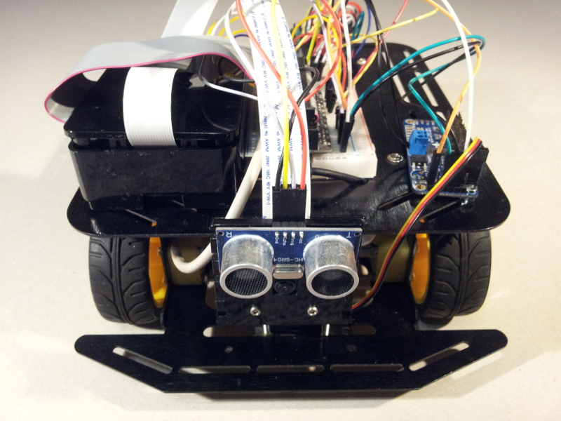
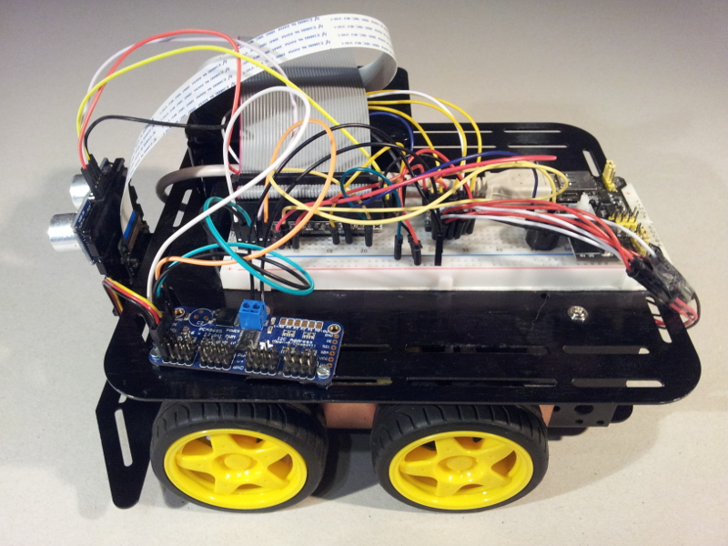
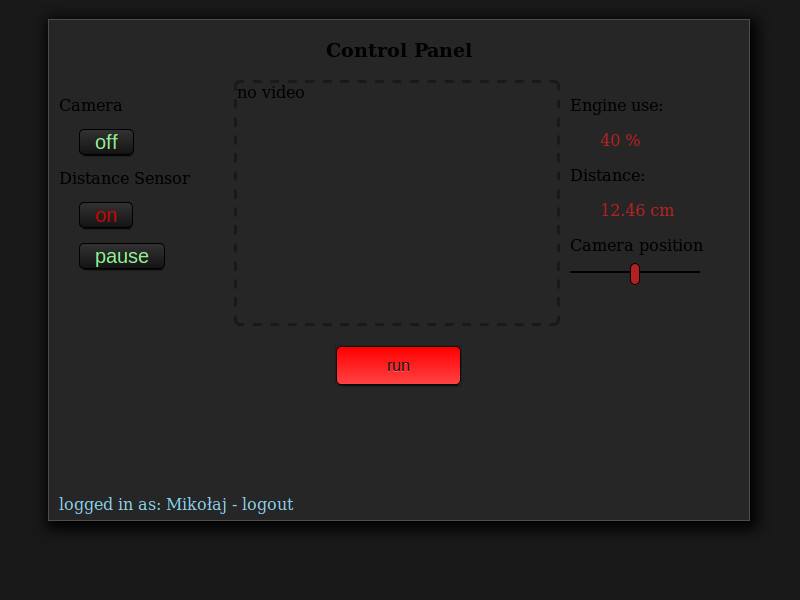

#Raspberry Pi robot

An application written as a final project on Coders Lab programming course
The goal of the project was to build a robot controlled by WiFi using Flask and jQuery.  Logged in users can control the robot movement, camera image, distance sensor. 

 {:height="150px" width="200px"} {:height="150px" width="200px"} {:height="150px" width="200px"}
